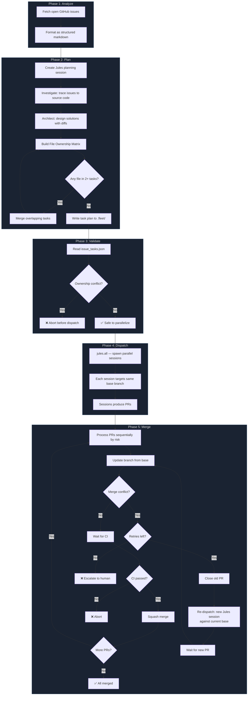

# Automate GitHub Issues

An Agent Skill that sets up your repository to automatically triage and fix GitHub issues using parallel Jules coding agents.

## What It Does

When activated, this skill **bootstraps your repository** with a 5-phase automated pipeline:

## Example Prompt

```text
Set up this GitHub repository to automate issue fixes with Jules.
```

## What Gets Created

The skill copies the following into your repository:

```
scripts/fleet/               # Pipeline scripts (committed to your repo)
├── fleet-analyze.ts
├── fleet-plan.ts
├── fleet-dispatch.ts
├── fleet-merge.ts
├── package.json
├── prompts/
│   ├── analyze-issues.ts    # Issue analysis prompt template
│   └── bootstrap.ts         # Bootstrap prompt for scheduled sessions
└── github/
    ├── git.ts               # Git repo utilities
    ├── issues.ts            # GitHub issue fetching
    ├── markdown.ts          # Issue → markdown formatting
    └── cache-plugin.ts      # ETag-based API caching

.github/workflows/
├── fleet-dispatch.yml       # Scheduled dispatch (daily cron)
└── fleet-merge.yml          # Auto-merge Jules PRs
```

## Prerequisites

- [Bun](https://bun.sh/) runtime
- A [Jules API key](https://jules.google.com/)
- GitHub token with repo access

### Pipeline Overview


| Phase | Script | What it does |
|-------|--------|-------------|
| **Analyze** | `fleet-analyze.ts` | Fetches open issues → structured markdown |
| **Plan** | `fleet-plan.ts` | Jules diagnoses root causes, builds File Ownership Matrix |
| **Validate** | `fleet-dispatch.ts` | Checks no two tasks claim the same file |
| **Dispatch** | `fleet-dispatch.ts` | Spawns parallel Jules sessions via `jules.all()` |
| **Merge** | `fleet-merge.ts` | Sequential merge: update branch → CI → squash |

### Detailed Flow



## Manual Usage

After setup, run the pipeline locally:

```bash
cd scripts/fleet

# Fetch open issues
bun fleet-analyze.ts

# Plan tasks (creates a Jules planning session)
JULES_API_KEY=<key> bun fleet-plan.ts

# Dispatch parallel agents
JULES_API_KEY=<key> bun fleet-dispatch.ts

# Merge PRs sequentially
GITHUB_TOKEN=<token> bun fleet-merge.ts
```

## Setup (after skill activation)

### 1. Set Secrets

Add `JULES_API_KEY` as a GitHub repository secret (Settings → Secrets → Actions).
`GITHUB_TOKEN` is provided automatically by GitHub Actions.

### 2. Customize

- Adjust the cron schedule in `.github/workflows/fleet-dispatch.yml` (default: daily 6am UTC)
- Tune the analysis prompt in `scripts/fleet/prompts/analyze-issues.ts`

### 3. Commit

Commit all generated files and push.

This is not an officially supported Google product.
