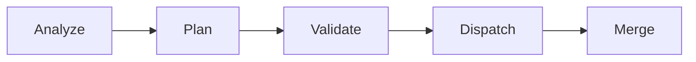

# Architecture: Automate GitHub Issues

This document describes the 5-phase pipeline that gets installed into your repository.

## Pipeline Overview



## Phase 1: Analyze

**Script:** `fleet-analyze.ts`

Fetches all open GitHub issues using the Octokit API with ETag caching. Formats them into a structured markdown document that includes:
- Issue number, title, author, labels
- State, timestamps, reactions
- Full description body

**Output:** Markdown string passed to the planner.

## Phase 2: Plan

**Script:** `fleet-plan.ts`
**Prompt:** `prompts/analyze-issues.ts`

Creates a Jules session that performs deep code-level triage:

1. **Investigate** — Trace each issue to its root cause in the codebase, referencing specific files, functions, and line ranges.
2. **Architect** — Design concrete solutions with TypeScript implementation code, integration diffs, and test scenarios.
3. **Plan** — Group root causes into tasks, produce a File Ownership Matrix ensuring no two tasks touch the same file.
4. **Dispatch** — Write the task plan to `.fleet/{date}/issue_tasks.json` and `.fleet/{date}/issue_tasks.md`.

**Critical constraint:** Merge conflict avoidance. Tasks are dispatched as parallel agents, so file ownership must be exclusive.

## Phase 3: Validate

**Script:** `fleet-dispatch.ts` (built in)

Before dispatching, the orchestrator validates ownership:
- Builds a map of every file claimed by each task (source, new, and test files)
- Throws if any file appears in more than one task
- This prevents merge conflicts when parallel PRs land

## Phase 4: Dispatch

**Script:** `fleet-dispatch.ts`

Spawns parallel Jules sessions using `jules.all()`:
- Each task gets its own session with a self-contained, code-rich prompt
- Sessions target the same base branch
- Session IDs are written to `.fleet/{date}/sessions.json` for the merge phase

## Phase 5: Merge

**Script:** `fleet-merge.ts` *(local)* / `fleet-merge.yml` *(GitHub Action)*

Processes fleet PRs sequentially in risk order (lowest first):

1. Find open PRs matching session IDs (local) or Jules author (GitHub Action)
2. For each PR: update branch from base
3. Wait for CI to pass (polling every 30s, timeout after 10min)
4. Squash-merge
5. Move to the next PR

If a merge conflict is detected during branch update, the process stops and reports the PR URL for human intervention.

## File Structure (after setup)

```text
scripts/fleet/
├── fleet-analyze.ts             # Fetches open issues as markdown
├── fleet-plan.ts                # Creates the planning session
├── fleet-dispatch.ts            # Validates ownership + dispatches Jules sessions
├── fleet-merge.ts               # Sequential PR merge with CI wait (local use)
├── types.ts                     # Shared TypeScript types
├── package.json                 # Fleet script dependencies
├── prompts/
│   ├── analyze-issues.ts        # The 4-phase analysis prompt
│   └── bootstrap.ts             # Wraps prompt for scheduled sessions
└── github/
    ├── git.ts                   # Git remote parsing (owner/repo/branch)
    ├── issues.ts                # GitHub issue fetching with cache
    ├── markdown.ts              # Issue → markdown formatting
    └── cache-plugin.ts          # Octokit ETag cache plugin
```

## Scheduled Automation

The `fleet-dispatch.yml` workflow runs the planning phase on a cron schedule:

1. Installs dependencies from `scripts/fleet/package.json`
2. Runs `fleet-plan.ts` to create a Jules planning session
3. The session fetches issues, analyzes them, and dispatches N parallel agents
4. Each agent produces a PR
5. The `fleet-merge.yml` workflow triggers on PR open events and merges them sequentially using `gh` CLI
