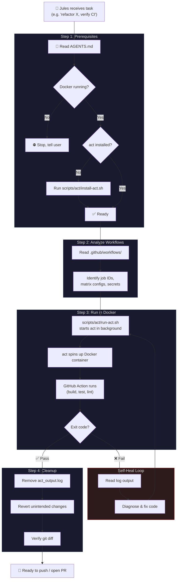

# Local Action Verification

A bootstrapper skill that sets up a repository for local GitHub Actions verification using [nektos/act](https://github.com/nektos/act). After setup, Jules can validate CI passes before pushing code.

## What It Does

When run, this skill copies scripts and instructions into the target repository:

```
scripts/act/
├── install-act.sh    # Installs act (platform-aware, sudo fallback)
└── run-act.sh        # Background runner with log polling and timeout
```

It also adds a **Local CI Verification** section to the repo's `AGENTS.md`, which Jules reads to discover and use the scripts during tasks.

## How It Works



## After Setup

Once the skill has set up the repository, Jules can verify CI locally whenever it's given a coding task. The skill itself is no longer needed — everything Jules needs is in the repo.

### Example Flow
1. Jules receives: *"Refactor lib/utils.js and verify CI"*
2. Jules reads `AGENTS.md` → sees "Local CI Verification" instructions
3. Jules runs `bash scripts/act/run-act.sh "push -j test"`
4. CI passes → Jules pushes / opens PR

## Prerequisites

- **Docker** — Must be installed and running (preinstalled on Jules VMs)
- **act** — Installed automatically by `scripts/act/install-act.sh`

## Limitations

- `act` does [not support all GitHub Actions features](https://github.com/nektos/act#known-issues) (e.g., service containers, some caching)
- Large Docker images can be slow to pull on first run
- Jobs requiring GitHub-specific secrets need a `.secrets` file

This is not an officially supported Google product.
